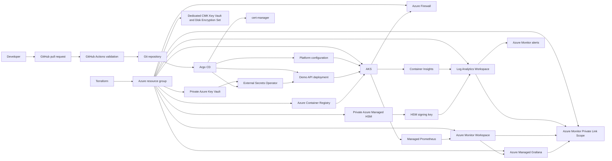

# Azure AKS GitOps reference platform

This repository is a focused reference implementation for an Azure platform delivery path: Terraform provisions Azure foundations, GitHub Actions validates changes, Argo CD reconciles Kubernetes desired state, and AKS runs observable workloads from ACR images.

## Implemented

- Modular Terraform for a resource group, VNet, AKS subnet, private-endpoint subnet, ACR, AKS, private Key Vault, and required identities/RBAC.
- AKS Microsoft Entra RBAC, managed identity, OIDC issuer, and Workload Identity.
- GitHub Actions Terraform formatting, initialization, validation, and OIDC-backed speculative plan.
- GitHub Actions API unit tests, container build validation, and Kustomize rendering for every Argo CD source tree.
- Argo CD app-of-apps hierarchy with a restricted AppProject, declarative ingress-nginx, and Azure Monitor metrics-agent configuration.
- Azure-native observability: Container Insights, Log Analytics, Managed Prometheus, Azure Managed Grafana, selected diagnostics, and two operational alerts.
- Azure Key Vault secret injection through Argo CD-managed External Secrets Operator and AKS Workload Identity; values never enter Git or Terraform state.
- Policy as code: Conftest/Rego validates rendered GitOps manifests in CI, and Terraform enables the AKS Azure Policy add-on for centrally managed audit-first runtime guardrails.
- Production-security foundation: Basic ACR, private Key Vault, security diagnostics, and production deletion protection.
- Regulated-security capabilities: opt-in AKS disk CMK/Disk Encryption Set, private Azure Managed HSM with an optional non-exportable signing key and per-key RBAC, Azure Firewall egress, Azure Monitor Private Link Scope, and GitOps-managed certificate controller. These capabilities are implemented in Terraform/GitOps but not Azure-deployment-verified.
- A minimal FastAPI `/health` and `/metrics` service with probes, resource controls, hardened pod settings, and an internal ingress route.
- Architecture decision records and an explicit Argo CD bootstrap command.

## Architecture



Terraform owns Azure resources and Azure RBAC. Argo CD owns Kubernetes resources. GitHub Actions builds and validates, but never deploys with `kubectl apply`.

## Repository layout

```text
infrastructure/modules/          Reusable Azure components
infrastructure/environments/dev/ Dev composition and outputs
clusters/dev/                    Argo CD app-of-apps entry point
platform/                        Namespaces and shared Helm releases
applications/demo-api/           API source, image build, and workload manifests
.github/workflows/               Infrastructure and application validation
docs/adr/                         Architecture decisions
```

## Prerequisites

- Azure CLI authenticated to the intended subscription.
- Terraform `>= 1.10`, `kubectl`, Docker, Git, and a `make` implementation.
- An explicit, supported Argo CD release for GitOps bootstrap.
- An Entra group for AKS administrators and an unused globally unique ACR name.
- A GitHub repository with a protected `main` branch and a `dev` environment.

On Windows, run the individual Terraform commands if `make` is unavailable, or install a compatible `make` tool.

## Azure foundation

Copy `infrastructure/environments/dev/dev.example.tfvars` to `dev.tfvars`, replace every placeholder, and keep that file uncommitted. Public AKS API access requires explicit administrator CIDRs. Leave `kubernetes_version = null` to accept Azure's currently supported default, or pin a version that has been tested in the target region. For production-like networking, set `private_cluster_enabled = true` and provide private connectivity before obtaining kubeconfig.

```bash
make init
make validate
make plan
make apply
make kubeconfig
kubectl get nodes
```

AKS uses its kubelet managed identity to pull images from ACR. No registry administrator credential is enabled.

## CI and identity

Follow [GitHub OIDC bootstrap](docs/github-oidc.md) before enabling Terraform plans. The workflow uses GitHub OIDC and does not require an Azure client secret. The `dev` Terraform state is local by default for a first deployment; use an Azure Storage backend with state locking and restricted access before shared or production use.

The application workflow runs tests and builds the container. The manual **Publish demo API** workflow uses OIDC and scoped `AcrPush` permission to publish an immutable image tag to ACR. After a successful publish, update the image tag in `applications/demo-api/deployment.yaml` through a pull request; that Git change is the deployment promotion consumed by Argo CD.

## GitOps workflow

After `kubectl get nodes` succeeds, bootstrap Argo CD from an administrator workstation:

```bash
export ARGOCD_VERSION="v<supported-version>"
export GIT_REPOSITORY_URL="https://github.com/your-org/azure-platform-gitops.git"
./scripts/bootstrap-argocd.sh
```

The bootstrap command is the one-time exception that installs Argo CD's HA profile and creates the `platform-root` Application. HA requires at least three schedulable nodes; set `system_node_min_count = 3` before bootstrap. `ARGOCD_INSTALL_PROFILE=standard` is available only as an explicit non-production exception. From then on, Argo CD continuously reconciles `clusters/dev`, which creates the platform and application Applications. The `platform` AppProject restricts child Applications to approved repositories and namespaces. For a private repository, update `clusters/dev/repository-config.yaml` to its SSH URL, supply a read-only deploy key through `GIT_SSH_PRIVATE_KEY`, and commit the URL change before bootstrap. Before applying the demo workload, replace the ACR hostname placeholder in `applications/demo-api/deployment.yaml` with the Terraform `acr_login_server` output and commit the change. See [Argo CD operations](docs/argocd-operations.md) for scaling and operational checks.

Platform components are internal by default: ingress-nginx requests an internal Azure load balancer. The demo is reachable at `demo-api.internal.example.com` after that name is mapped through private DNS to the ingress address.

## Drift demonstration

After Argo CD reports the `applications` Application as healthy and synced, mutate a managed value:

```bash
kubectl -n demo scale deployment/demo-api --replicas=1
kubectl -n demo get deployment demo-api
argocd app get applications
kubectl -n demo get deployment demo-api
```

The deployment returns to the Git-declared two replicas through Argo CD self-healing. The manual change is intentionally not committed; see [Argo CD operations](docs/argocd-operations.md) for the full drift workflow.

## Observability

AKS sends container logs to Azure Monitor Container Insights and `law-<project>-<environment>`. Managed Prometheus sends Kubernetes and annotated application metrics to `amw-<project>-<environment>`, while Azure Managed Grafana provides visualization through managed identity and Azure RBAC. Two Azure Monitor alerts detect excessive container restarts and missing demo API pods. See [Azure-native observability](docs/observability.md) for architecture, KQL, alerting, identity, troubleshooting, and cost guidance.

## Secret management

Terraform provides a private, RBAC-enabled Azure Key Vault with a private endpoint and a narrowly scoped federated managed identity. Argo CD installs External Secrets Operator and reconciles secret references; it does not store values. Populate Key Vault secrets from an approved private-network operator workflow, then allow the operator to synchronize them into the target namespace. See [Azure Key Vault secret management](docs/secret-management.md) for the required identifier configuration, rotation workflow, security boundary, and troubleshooting steps.

## Production security foundation

The baseline production profile uses private AKS access, Basic ACR, private Key Vault, 90-day Key Vault soft-delete retention, purge protection, and selected security diagnostics. Basic ACR preserves GitHub-hosted image publishing. See [production security foundation](docs/production-security-foundation.md) for values, DNS checks, and operational controls.

## Policy as code

GitHub Actions renders Argo CD sources and uses Conftest/Rego to block insecure workload declarations before merge. Terraform enables the AKS Azure Policy add-on for organization-managed Kubernetes policy assignments. Introduce Azure Policy assignments in audit mode, review results, then enforce selected controls; do not install a standalone Gatekeeper alongside the Azure add-on. See [policy as code](docs/policy-as-code.md) for the baseline rules, local commands, ownership, and exception workflow.

## Regulated security profile

The optional regulated profile adds a dedicated CMK Key Vault and Disk Encryption Set, Azure Managed HSM for CA/signing-key workloads, Azure Firewall with UDR-based AKS egress, Azure Monitor Private Link Scope, and GitOps-managed `cert-manager`.

| Capability | Owner | Activation constraint |
| --- | --- | --- |
| AKS disk CMK | Terraform | Create or migrate to a replacement private cluster. |
| Basic ACR | Terraform | Public publishing path is required for GitHub-hosted runners. |
| Managed HSM key custody | Terraform | Define security-domain administrators, a signing identity, quorum, backup, and recovery ownership. |
| Firewall egress | Terraform | Review required FQDNs, DNS, routes, and denied-flow monitoring. |
| AMPLS | Terraform | Validate private DNS and Grafana managed private endpoint connectivity. |
| Public ACME certificates | Argo CD | Provide delegated DNS, ACME email, and DNS Workload Identity. |

See the [regulated security profile](docs/regulated-security-profile.md), [Managed HSM key custody](docs/managed-hsm-operations.md), and [certificate management](docs/certificate-management.md) before enabling these controls.

## Cleanup

First remove Argo CD-managed resources if the cluster is reachable.

```bash
kubectl delete application --all --namespace argocd
kubectl delete namespace argocd
make destroy
```

Destroying AKS also removes Argo CD and all workloads. Review the Terraform plan before confirmation, especially if state has been moved to a shared backend.

## Limitations and future improvements

- Implemented state storage is local only; shared environments need a protected remote state backend.
- Image-tag promotion remains a pull-request step after immutable ACR image publication.
- The sample uses one system node pool, Basic ACR, and no availability-zone strategy.
- The regulated modules and AMPLS configuration are locally validated only; Azure deployment, private DNS resolution, Grafana private queries, and AKS telemetry ingestion still require verification in a target subscription.
- The Basic ACR profile does not provide ACR Private Link or ACR CMK. AKS disk CMK remains available through the dedicated Standard Key Vault.
- `cert-manager` is installed declaratively, but no production `ClusterIssuer` is configured until a delegated DNS zone and ACME registration details are supplied.
- Managed HSM key custody provisions the HSM key and Azure-side access pattern only; an approved signing service, certificate chain, timestamp authority, BYOK ceremony, and security-domain recovery exercise remain organization-specific work.
- Future work can add dashboard-as-code, action groups, dedicated workload node pools, backup/disaster recovery, image scanning, and Git-based image promotion automation after operating requirements justify them.

See [the ADRs](docs/adr) for the reasoning behind AKS, Argo CD, ownership boundaries, federated identity, Azure-native observability, and Key Vault secret injection.
