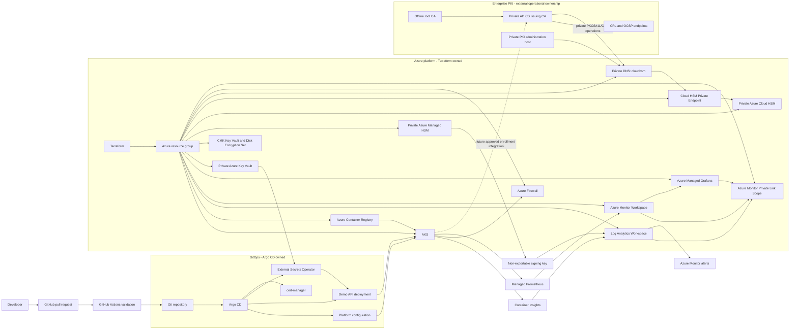
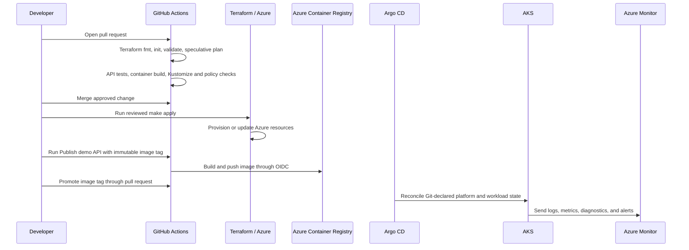

# Azure AKS GitOps reference platform

This repository is a focused reference implementation for an Azure platform delivery path: Terraform provisions Azure foundations, GitHub Actions validates changes, Argo CD reconciles Kubernetes desired state, and AKS runs observable workloads from ACR images.

## Platform as a product

The platform is for application developers who need a secure, observable, repeatable path to AKS without managing its Azure, Terraform, Kubernetes, or Argo CD internals. The supported interface is a small application registration that generates a reviewed Kustomize workload and is reconciled by Argo CD.

- Read the [platform product definition](docs/platform-product.md) for users, capabilities, ownership, SLO design targets, feedback, boundaries, and roadmap.
- Follow the [developer guide](docs/developer-guide.md) to register and promote a service in approximately ten minutes.
- Use `make doctor`, `make security`, `make onboard-demo`, `make onboard-check`, and `make test-onboarding` for local preflight and golden-path validation.

The registration generator provides Namespace, Deployment, Service, PDB, HPA, NetworkPolicy, pod hardening, probes, labels, metrics annotations, optional ingress, and optional External Secrets references. A registration requesting Key Vault access must use an approved Azure Workload Identity and Key Vault Private Endpoint host CIDR(s); the generator permits HTTPS only to those addresses. Azure identity provisioning and Key Vault CSI self-service provisioning are deliberately deferred until their Azure RBAC and operational ownership models are implemented.

## Requirements addressed

The platform demonstrates how a regulated engineering organization can deliver Kubernetes workloads while protecting sensitive keys, certificates, and operational data.

### Business requirements

| Requirement | How this implementation addresses it | Status |
| --- | --- | --- |
| Deliver business applications predictably | Pull-request validation, immutable image publication, and Argo CD reconciliation make deployment changes reviewable and repeatable. | Implemented |
| Reduce security and outage risk | Private-by-default services, least-privilege identities, policy checks, monitoring, alerts, and GitOps drift recovery reduce manual-change risk. | Implemented foundation |
| Protect high-value cryptographic assets | Key Vault protects application secrets and CMK material; Managed HSM protects non-exportable signing keys; Cloud HSM provides the private issuing-CA boundary. | Implemented foundation |
| Support audit and compliance evidence | Terraform state, Git history, CI validation, Azure diagnostics, and Log Analytics establish change and operational evidence. | Implemented foundation |
| Support trusted internal service identity | The enterprise PKI design separates an offline root, an issuing CA, HSM-backed CA keys, and certificate lifecycle operations. | Azure boundary implemented; CA operations external |
| Maintain operational continuity | Soft delete, purge protection, rotation policies, diagnostics, recovery runbooks, and explicit ownership support controlled recovery. | Implemented foundation |

### Technical requirements

| Requirement | Implementation |
| --- | --- |
| Repeatable Azure infrastructure | Modular Terraform provisions AKS, ACR, networking, observability, Key Vault, HSM capabilities, and required Azure RBAC. |
| Secure workload identity | AKS OIDC and Workload Identity avoid static Azure credentials for Kubernetes workloads; GitHub Actions uses OIDC for Azure access. |
| GitOps deployment control | Argo CD reconciles Kubernetes desired state from Git; CI renders and validates manifests but does not use `kubectl apply` for deployment. |
| Container supply path | The kubelet identity receives `AcrPull`; GitHub publishing uses scoped `AcrPush`; image promotion is a reviewed Git change. |
| Central observability | Container Insights, Log Analytics, Managed Prometheus, Managed Grafana, diagnostics, and focused alerts provide operational signals. |
| Key and certificate separation | Application secrets, AKS disk CMK, signing keys, and issuing-CA keys use separate services, identities, and administrator boundaries. |
| Private cryptographic connectivity | Key Vault, Managed HSM, and Cloud HSM use private endpoints and private DNS; public access is disabled where implemented. |
| Enterprise CA foundation | Azure Cloud HSM is provisioned through pinned AzAPI with a backup identity and private endpoint; AD CS installation and CA ceremonies stay outside IaC. |
| Controlled PKI lifecycle | Documentation defines root/issuing-CA separation, HSM initialization, CRL/OCSP, recovery, and the future AKS enrollment decision. |

The platform intentionally does not claim that AD CS, an offline root CA, CRL/OCSP, or a Kubernetes certificate issuer are deployed. Those require organization-specific PKI governance and approved operational ceremonies.

## Security and cryptography

Read the [security posture assessment](docs/security-posture.md) for the current control assessment, development-versus-production differences, and prioritized hardening actions. Read [cryptographic platform and certificate authority](docs/cryptographic-platform.md) for the key hierarchy, HSM roles, CA trust model, lifecycle controls, and ownership boundaries.

## Managed HSM cryptographic MVP

**Business problem:** a backend must prove that a sensitive transaction was approved without storing its signing private key in code, containers, Kubernetes, or application memory.

**Solution:** the API hashes the transaction, authenticates through AKS Workload Identity and Microsoft Entra ID, and calls a non-exportable Managed HSM key. The HSM returns a signature; `/verify` validates it through the same HSM-backed key.

**Security properties:** a custom per-key role permits only metadata read, sign, and verify; there are no client secrets; HSM audit events flow to Log Analytics; and alerts identify failed or key-management operations. See [Managed HSM cryptographic MVP](docs/managed-hsm-crypto-mvp.md) for enablement values, identity flow, API calls, and security boundaries.

## Implemented

- Modular Terraform for a resource group, VNet, AKS subnet, private-endpoint subnet, ACR, AKS, private Key Vault, and required identities/RBAC.
- AKS Microsoft Entra RBAC, managed identity, OIDC issuer, and Workload Identity.
- GitHub Actions Terraform formatting, initialization, validation, and OIDC-backed speculative plan.
- GitHub Actions API unit tests, container build validation, and Kustomize rendering for every Argo CD source tree.
- Argo CD app-of-apps hierarchy with a restricted AppProject, declarative ingress-nginx, and Azure Monitor metrics-agent configuration.
- Azure-native observability: Container Insights, Log Analytics, Managed Prometheus, Azure Managed Grafana, selected diagnostics, and two operational alerts.
- Azure Key Vault secret injection through Argo CD-managed External Secrets Operator and AKS Workload Identity; values never enter Git or Terraform state.
- Policy as code: Conftest/Rego validates rendered GitOps manifests in CI, and Terraform enables the AKS Azure Policy add-on for centrally managed audit-first runtime guardrails.
- Production-security foundation: Basic ACR, private Key Vault, security diagnostics, and production deletion protection.
- Regulated-security capabilities: opt-in AKS disk CMK/Disk Encryption Set, private Azure Managed HSM signing-key custody, Azure Cloud HSM foundation for an externally governed AD CS issuing CA, Azure Firewall egress, Azure Monitor Private Link Scope, and GitOps-managed certificate controller. These capabilities are implemented in Terraform/GitOps but not Azure-deployment-verified.
- A minimal FastAPI `/health` and `/metrics` service with probes, resource controls, hardened pod settings, and an internal ingress route.
- Architecture decision records and an explicit Argo CD bootstrap command.

## Architecture



Terraform owns Azure resources and Azure RBAC. Argo CD owns Kubernetes resources. GitHub Actions builds and validates, but never deploys with `kubectl apply`.

## Repository layout

```text
infrastructure/modules/          Reusable Azure components
infrastructure/environments/dev/ Dev composition and outputs
clusters/dev/                    Argo CD app-of-apps entry point
platform/                        Namespaces and shared Helm releases
applications/demo-api/           API source, image build, and workload manifests
applications/registrations/      Developer-facing application registration contracts
applications/onboarded/          Generated, reviewed Kustomize workloads
templates/service-api/           Golden-path schema and template contract
.github/workflows/               Infrastructure and application validation
docs/adr/                         Architecture decisions
```

## Prerequisites

- Azure CLI authenticated to the intended subscription.
- Terraform `>= 1.10`, `kubectl`, Docker, Git, and a `make` implementation.
- An explicit, supported Argo CD release for GitOps bootstrap.
- An Entra group for AKS administrators and an unused globally unique ACR name.
- A GitHub repository with a protected `main` branch and a `dev` environment.

On Windows, run the individual Terraform commands if `make` is unavailable, or install a compatible `make` tool.

## Azure foundation

Copy `infrastructure/environments/dev/dev.example.tfvars` to `dev.tfvars`, replace every placeholder, and keep that file uncommitted. Public AKS API access requires explicit administrator CIDRs. Leave `kubernetes_version = null` to accept Azure's currently supported default, or pin a version that has been tested in the target region. For production-like networking, set `private_cluster_enabled = true` and provide private connectivity before obtaining kubeconfig.

```bash
make init
make validate
make plan
make apply
make kubeconfig
kubectl get nodes
```

AKS uses its kubelet managed identity to pull images from ACR. No registry administrator credential is enabled.

## CI and identity

Follow [GitHub OIDC bootstrap](docs/github-oidc.md) before enabling Terraform plans. The workflow uses GitHub OIDC and does not require an Azure client secret. The `dev` Terraform state is local by default for a first deployment; use an Azure Storage backend with state locking and restricted access before shared or production use.

The application workflow runs tests and builds the container. The manual **Publish demo API** workflow uses OIDC and scoped `AcrPush` permission to publish an immutable image tag to ACR. After a successful publish, update the image tag in `applications/demo-api/deployment.yaml` through a pull request; that Git change is the deployment promotion consumed by Argo CD.

## Delivery workflow

The platform uses Git as the desired-state record. GitHub Actions validates proposed changes but does not deploy Kubernetes resources with `kubectl apply`.



| Workflow | Trigger | What happens | Ownership boundary |
| --- | --- | --- | --- |
| Infrastructure validation | Pull request affecting `infrastructure/**` | Formats, initializes, validates, and—when OIDC environment variables are configured—creates a speculative Terraform plan. | GitHub Actions validates; Terraform owns Azure. |
| Application validation | Pull request affecting `applications/demo-api/**` | Audits Python dependencies, runs API tests, and validates the container build. | GitHub Actions validates; no deployment occurs. |
| GitOps validation | Pull request affecting `clusters/**`, `platform/**`, or `applications/**` | Renders Kustomize sources and evaluates Conftest/Rego policy. | GitHub Actions validates; Argo CD owns deployment. |
| Image publishing | Manual `Publish demo API` workflow | Uses GitHub OIDC and scoped `AcrPush` to publish an immutable ACR image tag. | GitHub Actions builds; Git promotion selects deployment. |
| Workload promotion | Pull request updating the image tag | Argo CD detects the merged desired-state change and reconciles AKS. | Argo CD owns Kubernetes state. |
| Drift recovery | Manual mutation or configuration drift | Argo CD self-heals reconciled resources back to Git. | Git remains authoritative. |
| Observability | Continuous AKS and Azure telemetry | Azure Monitor collects logs, metrics, diagnostics, and evaluates alerts. | Terraform owns Azure monitoring resources. |

Terraform applies are intentionally operator-initiated and reviewed; this reference implementation does not auto-apply Azure changes after merge. Kubernetes deployments are intentionally Argo CD-driven after the one-time bootstrap described below.

## GitOps workflow

After `kubectl get nodes` succeeds, bootstrap Argo CD from an administrator workstation:

```bash
export ARGOCD_VERSION="v<supported-version>"
export GIT_REPOSITORY_URL="https://github.com/your-org/azure-platform-gitops.git"
./scripts/bootstrap-argocd.sh
```

The bootstrap command is the one-time exception that installs Argo CD's HA profile and creates the `platform-root` Application. HA requires at least three schedulable nodes; set `system_node_min_count = 3` before bootstrap. `ARGOCD_INSTALL_PROFILE=standard` is available only as an explicit non-production exception. From then on, Argo CD continuously reconciles `clusters/dev`, which creates the platform and application Applications. The `platform` AppProject restricts child Applications to approved repositories and namespaces. For a private repository, update `clusters/dev/repository-config.yaml` to its SSH URL, supply a read-only deploy key through `GIT_SSH_PRIVATE_KEY`, and commit the URL change before bootstrap. Before applying the demo workload, replace the ACR hostname placeholder in `applications/demo-api/deployment.yaml` with the Terraform `acr_login_server` output and commit the change. See [Argo CD operations](docs/argocd-operations.md) for scaling and operational checks.

Platform components are internal by default: ingress-nginx requests an internal Azure load balancer. The demo is reachable at `demo-api.internal.example.com` after that name is mapped through private DNS to the ingress address.

## Drift demonstration

After Argo CD reports the `applications` Application as healthy and synced, mutate a managed value:

```bash
kubectl -n demo scale deployment/demo-api --replicas=1
kubectl -n demo get deployment demo-api
argocd app get applications
kubectl -n demo get deployment demo-api
```

The deployment returns to the Git-declared two replicas through Argo CD self-healing. The manual change is intentionally not committed; see [Argo CD operations](docs/argocd-operations.md) for the full drift workflow.

## Observability

AKS sends container logs to Azure Monitor Container Insights and `law-<project>-<environment>`. Managed Prometheus sends Kubernetes and annotated application metrics to `amw-<project>-<environment>`, while Azure Managed Grafana provides visualization through managed identity and Azure RBAC. Two Azure Monitor alerts detect excessive container restarts and missing demo API pods. See [Azure-native observability](docs/observability.md) for architecture, KQL, alerting, identity, troubleshooting, and cost guidance.

The minimum platform dashboard model uses Azure built-in AKS/Managed Prometheus views for node health, pod health, CPU/memory saturation, restart rates, and deployment availability. Argo CD sync/health is owned by the platform team; workload availability and application-specific thresholds are owned by the application team. Dashboard-as-code and GitHub Actions deployment-result telemetry are future improvements; see [platform product](docs/platform-product.md).

## Secret management

Terraform provides a private, RBAC-enabled Azure Key Vault with a private endpoint and a narrowly scoped federated managed identity. Argo CD installs External Secrets Operator and reconciles secret references; it does not store values. Populate Key Vault secrets from an approved private-network operator workflow, then allow the operator to synchronize them into the target namespace. See [Azure Key Vault secret management](docs/secret-management.md) for the required identifier configuration, rotation workflow, security boundary, and troubleshooting steps.

## Production security foundation

The baseline production profile uses private AKS access, Basic ACR, private Key Vault, 90-day Key Vault soft-delete retention, purge protection, and selected security diagnostics. Basic ACR preserves GitHub-hosted image publishing. See [production security foundation](docs/production-security-foundation.md) for values, DNS checks, and operational controls.

## Policy as code

GitHub Actions renders Argo CD sources and uses Conftest/Rego to block insecure workload declarations before merge. Terraform enables the AKS Azure Policy add-on for organization-managed Kubernetes policy assignments. Introduce Azure Policy assignments in audit mode, review results, then enforce selected controls; do not install a standalone Gatekeeper alongside the Azure add-on. See [policy as code](docs/policy-as-code.md) for the baseline rules, local commands, ownership, and exception workflow.

## Regulated security profile

The optional regulated profile adds a dedicated CMK Key Vault and Disk Encryption Set, Azure Managed HSM signing-key custody, Azure Firewall with UDR-based AKS egress, Azure Monitor Private Link Scope, and GitOps-managed `cert-manager`.

| Capability | Owner | Activation constraint |
| --- | --- | --- |
| AKS disk CMK | Terraform | Create or migrate to a replacement private cluster. |
| Basic ACR | Terraform | Public publishing path is required for GitHub-hosted runners. |
| Managed HSM key custody | Terraform | Define security-domain administrators, a signing identity, quorum, backup, and recovery ownership. |
| Firewall egress | Terraform | Review required FQDNs, DNS, routes, and denied-flow monitoring. |
| AMPLS | Terraform | Validate private DNS and Grafana managed private endpoint connectivity. |
| Public ACME certificates | Argo CD | Provide delegated DNS, ACME email, and DNS Workload Identity. |

See the [regulated security profile](docs/regulated-security-profile.md), [Managed HSM key custody](docs/managed-hsm-operations.md), and [certificate management](docs/certificate-management.md) before enabling these controls.

## Enterprise private PKI

The optional enterprise PKI profile implements the Azure security boundary for a two-tier AD CS design. It provisions a private Azure Cloud HSM, backup identity, Private Endpoint, and private DNS for the issuing-CA key. It is disabled by default because Cloud HSM is a dedicated premium service and requires an approved PKI operating model.

| PKI component | Status | Owner |
| --- | --- | --- |
| Azure Cloud HSM, backup identity, Private Endpoint, private DNS | Implemented | Terraform |
| Offline root CA and root-key ceremony | External, required before issuance | PKI/security team |
| Online AD CS issuing CA host and HSM initialization | External, required before issuance | PKI/platform team |
| CRL/OCSP, certificate templates, enrollment authorization | External, required before issuance | PKI team |
| AKS/cert-manager enrollment connector | Future, select after CA interface review | GitOps/platform team |

Enable it only after confirming Cloud HSM quota, cost, private CA-host connectivity, administrator separation, backup/recovery ownership, and an AD CS enrollment design. The CA private key must never enter Git, Terraform state, or Kubernetes. See [enterprise private PKI](docs/enterprise-private-pki.md) for the implementation boundary and operational checklist.

### PKI workflow

1. Security and PKI owners approve the CA hierarchy, recovery custodians, Cloud HSM capacity, and private network design.
2. A reviewed Terraform change enables the Cloud HSM foundation; an approved operator runs `make apply`.
3. A private administration host initializes Cloud HSM and verifies the Private Endpoint with `scripts/test-cloud-hsm-preflight.ps1`.
4. The PKI team performs the offline-root and issuing-CA ceremonies, then operates AD CS, CRL, OCSP, templates, and renewal processes outside this repository.
5. A future reviewed GitOps change can add an AKS enrollment connector after its AD CS interface, identity, and secret-storage model are approved.

Steps 3–5 are not automated by Terraform or GitHub Actions. They intentionally require controlled operational procedures.


## Limitations and future improvements

- Implemented state storage is local only; shared environments need a protected remote state backend.
- Image-tag promotion remains a pull-request step after immutable ACR image publication.
- The sample uses one system node pool, Basic ACR, and no availability-zone strategy.
- The regulated modules and AMPLS configuration are locally validated only; Azure deployment, private DNS resolution, Grafana private queries, and AKS telemetry ingestion still require verification in a target subscription.
- The Basic ACR profile does not provide ACR Private Link or ACR CMK. AKS disk CMK remains available through the dedicated Standard Key Vault.
- `cert-manager` is installed declaratively, but no production `ClusterIssuer` is configured until a delegated DNS zone and ACME registration details are supplied.
- Managed HSM key custody provisions the HSM key and Azure-side access pattern only; an approved signing service, certificate chain, timestamp authority, BYOK ceremony, and security-domain recovery exercise remain organization-specific work.
- Enterprise private PKI provisions only the Azure Cloud HSM boundary. It does not deploy AD CS, Active Directory, CRL/OCSP endpoints, an offline root, HSM initialization, or a Kubernetes certificate issuer.
- Future work can add dashboard-as-code, action groups, dedicated workload node pools, backup/disaster recovery, image scanning, and Git-based image promotion automation after operating requirements justify them.

See [the ADRs](docs/adr) for the reasoning behind AKS, Argo CD, ownership boundaries, federated identity, Azure-native observability, and Key Vault secret injection.
