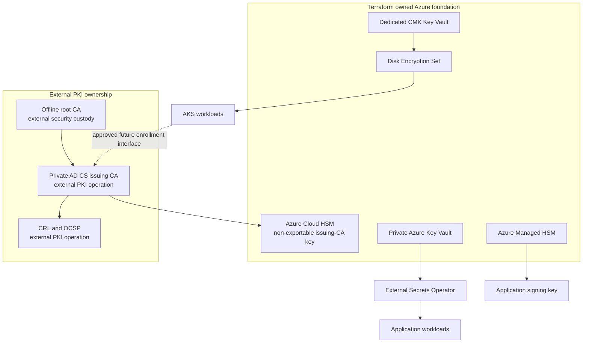

# Cryptographic platform and certificate authority

## Purpose

This document defines how the platform separates cryptographic assets, identities, and operational responsibilities. The objective is to protect private material, support auditable key lifecycle management, and establish a safe foundation for an enterprise private certificate authority (CA).

It is an architecture and operating model. Azure Cloud HSM infrastructure is implemented in Terraform, but the offline root CA, AD CS issuing CA, HSM initialization, and certificate issuance lifecycle are external controlled operations.

## Asset and service separation

| Asset | Azure service | Intended use | Key access boundary |
| --- | --- | --- | --- |
| Application secrets | Private Azure Key Vault | Runtime secrets synchronized by External Secrets Operator. | AKS Workload Identity receives `Key Vault Secrets User`; secret values are not committed. |
| AKS disk encryption key | Dedicated Standard Key Vault and Disk Encryption Set | Optional customer-managed encryption key for AKS disks. | Disk Encryption Set identity receives only the required crypto role; AKS receives Reader on the DES. |
| Application signing key | Azure Managed HSM | Optional non-exportable `RSA-HSM` key for code or release-signing use cases. | Explicit signing identities receive a custom metadata-read/sign/verify role at the individual key scope; auditors receive Crypto Auditor at that scope. |
| Issuing-CA key | Azure Cloud HSM | Private key for an externally operated AD CS issuing CA. | PKCS#11/CNG/KSP access from approved private CA hosts; no key material is managed by Terraform or Kubernetes. |
| Root-CA key | External offline root CA | Signs the issuing CA and anchors internal trust. | Separate, offline security ceremony and custody process outside this platform. |

The separation prevents a compromise in one workload or service from automatically granting access to unrelated secrets, disk-encryption keys, signing keys, or CA keys.

## Trust architecture

## Key flows

### Application secret retrieval

1. A platform operator creates or rotates the secret through an approved private Key Vault workflow.
2. External Secrets Operator authenticates using an AKS federated workload identity.
3. The operator reads only the referenced secret and creates the Kubernetes Secret required by the workload.
4. The application consumes the Kubernetes Secret; secret values are not stored in Git or Terraform state.

### AKS disk CMK

1. Terraform creates a dedicated Key Vault key and Disk Encryption Set when the CMK profile is enabled.
2. The Disk Encryption Set identity receives the narrowly scoped encryption role on the key.
3. AKS references the Disk Encryption Set for disk encryption.
4. Key rotation, recovery, and AKS replacement/migration effects require change planning before activation.

### Code or release signing

1. Terraform creates an optional `RSA-HSM` signing key in Managed HSM with only `sign` and `verify` operations.
2. Terraform assigns Managed HSM local RBAC at `/keys/<signing-key-name>`, not HSM-wide scope.
3. An approved signing service authenticates with a managed or workload identity from a private network.
4. The service signs a digest through the HSM crypto API and stores the signature and public certificate chain with the artifact.
5. Audit events are forwarded to Log Analytics; the private key remains non-exportable.

### Private certificate issuance

1. PKI owners maintain an offline root CA under a separate recovery and custody process.
2. An approved private CA host initializes Azure Cloud HSM and creates or imports the issuing-CA key through a controlled ceremony.
3. AD CS is configured to use the Cloud HSM cryptographic provider and receives a subordinate-CA certificate from the root.
4. AD CS issues certificates according to approved templates and publishes CRL/OCSP endpoints.
5. AKS integration is added only after the CA enrollment interface, authorization model, and certificate-private-key storage model are approved.

Do not use an in-cluster CA issuer for the enterprise CA: that pattern would require the CA private key to be available to Kubernetes.

## Ownership and separation of duties

| Activity | Owner | Required control |
| --- | --- | --- |
| Azure resource definitions and Azure RBAC | Platform team | Terraform review, protected state, least privilege. |
| Kubernetes desired state | Platform/application teams | Argo CD reconciliation, pull-request review, policy validation. |
| Application secret values | Secret owners | Private Key Vault workflow, rotation and access review. |
| Managed HSM signing-key administration | Security/key-custody team | Named administrators, per-key RBAC, audit review, recovery ownership. |
| Cloud HSM initialization and backup/recovery | PKI/security team | Private administration host, quorum/custodians, tested recovery. |
| Root and issuing CA operations | PKI team | Offline-root ceremony, CA host hardening, certificate policy, CRL/OCSP and revocation testing. |
| Certificate consumers | Application/platform teams | Approved enrollment identity, renewal monitoring, trust-store management. |

## Lifecycle and recovery controls

- Assign a named key owner, technical custodian, recovery owner, and approval authority to every production key.
- Use separate identities for administration, key use, audit, backup, and restore.
- Keep private keys non-exportable where supported; never place private keys in Git, CI logs, Terraform variables, Kubernetes manifests, or container images.
- Review key operations and role changes through Azure diagnostics and Log Analytics.
- Test HSM and CA recovery, certificate revocation, CRL/OCSP availability, and trust-store rollover on a scheduled basis.
- Rotate signing keys before expiry and support verification of historical signatures during transition.
- Maintain root and issuing CA keys, backup artifacts, and break-glass procedures under separate custody.

## Current implementation status

| Capability | Status |
| --- | --- |
| Private Key Vault and federated secret retrieval | Implemented in Terraform and Argo CD; Azure deployment verification required. |
| AKS disk CMK / Disk Encryption Set | Optional Terraform capability; disabled by default and may require AKS replacement planning. |
| Managed HSM signing-key custody | Optional Terraform capability with per-key RBAC, rotation, private endpoint, and diagnostics. |
| Cloud HSM private foundation | Optional Terraform capability with backup identity, Private Endpoint, private DNS, and disabled public network access. |
| Offline root, AD CS issuing CA, CRL/OCSP, templates, enrollment | Not implemented; external PKI program required. |
| AKS certificate enrollment connector | Not implemented; select only after CA and identity review. |

## References

- [Managed HSM key custody](managed-hsm-operations.md)
- [Enterprise private PKI foundation](enterprise-private-pki.md)
- [Certificate management](certificate-management.md)
- [Security posture assessment](security-posture.md)
- [Azure Cloud HSM network security](https://learn.microsoft.com/azure/cloud-hsm/network-security)
- [Managed HSM local RBAC roles](https://learn.microsoft.com/azure/key-vault/managed-hsm/built-in-roles)
