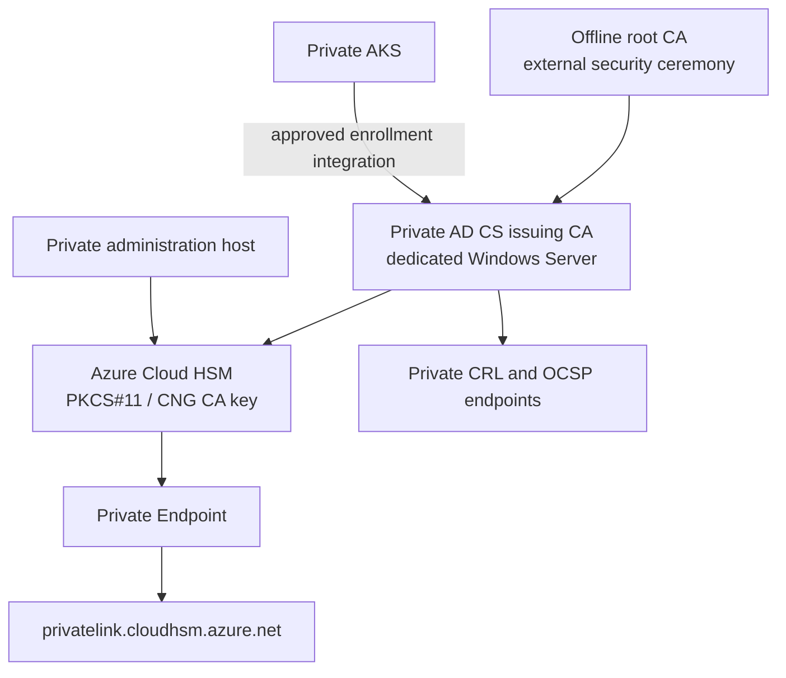

# Enterprise private PKI foundation

This optional profile implements the Azure foundation for a two-tier Active Directory Certificate Services (AD CS) private PKI. It is intended for regulated environments that need internal issuance, revocation, certificate templates, and HSM-protected issuing-CA keys.

## Design



The offline root CA is deliberately not provisioned by this repository. Its key custody, backup media, access policy, and physical/offline controls are organization-specific security responsibilities. Terraform creates only the Azure Cloud HSM foundation required by the online issuing CA.

## Implemented Azure foundation

When `enterprise_pki_enabled = true`, Terraform creates:

- Azure Cloud HSM through the Azure Resource Manager API using the pinned AzAPI provider, because the current AzureRM provider has no first-class Cloud HSM resource.
- A user-assigned managed identity reserved for Cloud HSM backup and restore integration.
- A Private Endpoint, private DNS zone `privatelink.cloudhsm.azure.net`, and VNet link.
- Disabled Cloud HSM public network access.

Cloud HSM is intentionally separate from Azure Managed HSM. Managed HSM remains the repository's optional REST-based signing-key custody service. Cloud HSM is selected for the issuing CA because it supports the PKCS#11/CNG/KSP integration expected by CA software.

## Enablement

Use a private, uncommitted variable file after confirming regional Cloud HSM quota, commercial terms, administrator ownership, and a private CA-host network.

```hcl
private_cluster_enabled = true
enterprise_pki_enabled = true
cloud_hsm_name         = "chsm-example-prod"
cloud_hsm_sku_capacity = 1
```

Run the Azure foundation preflight from an authenticated operator workstation:

```powershell
./scripts/test-cloud-hsm-preflight.ps1 `
  -ResourceGroupName rg-platform-dev `
  -CloudHsmName chsm-example-prod
```

The script checks public network access, the backup identity, and Private Endpoint approval. It does not initialize the HSM or access CA key material.

## Required external implementation

The following steps must be performed through approved PKI change control, not Terraform or GitOps:

1. Build a dedicated, domain-joined Windows Server issuing-CA host in the approved hub/spoke network.
2. Initialize Cloud HSM using the Azure Cloud HSM SDK from an administration host with private DNS connectivity.
3. Establish crypto officer, crypto user, quorum, backup, and recovery ownership.
4. Create a non-exportable issuing-CA key in Cloud HSM and configure the AD CS cryptographic provider.
5. Issue and install the subordinate-CA certificate from the offline root ceremony.
6. Publish highly available CRL and OCSP endpoints, then test revocation from every relying network.
7. Define certificate templates, enrollment authorization, approval paths, validity periods, and renewal alerts.
8. Select and validate an AKS enrollment integration. Do not use cert-manager's in-cluster CA issuer because it would require the CA private key in Kubernetes.

The final step depends on the organization’s approved AD CS enrollment interface or a supported enterprise PKI connector. Add it as a separate GitOps change only after its identity and secret-storage model have been reviewed.

## Security and recovery

- Operate the root and issuing CA with separate administrators and separate keys.
- Use Entra PIM, just-in-time administration, and audited break-glass procedures for Azure resource access.
- Restrict Cloud HSM administration and CA hosts to private networks; validate `privatelink.cloudhsm.azure.net` resolution from all administration and CA hosts.
- Store backup and recovery materials outside Terraform, CI, and developer workstations. Assign the Cloud HSM backup identity only after a protected backup target and retention policy are approved.
- Test root recovery, HSM recovery, issuing-CA restoration, CRL availability, and certificate revocation on a scheduled basis.

## Cost and limitations

Azure Cloud HSM is a dedicated service and can require capacity/quota approval. This repository does not create Windows VMs, Active Directory, AD CS, CRL/OCSP infrastructure, Cloud HSM initialization, CA keys, or certificate templates. Those pieces cannot be safely automated without organization-specific identity, domain, network, recovery, and compliance decisions.

See [Azure Cloud HSM networking guidance](https://learn.microsoft.com/azure/cloud-hsm/network-security), [Cloud HSM deployment guidance](https://learn.microsoft.com/azure/cloud-hsm/quickstart-powershell), and [AD CS overview](https://learn.microsoft.com/windows-server/identity/ad-cs/active-directory-certificate-services-overview).
