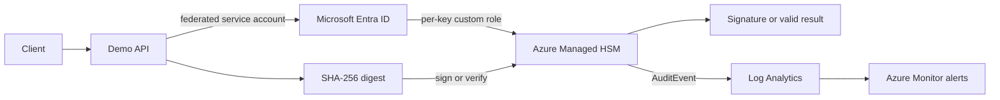

# Managed HSM cryptographic MVP

## Business problem

A backend service must sign sensitive business transactions without storing a private key in source code, a container image, Kubernetes, or application memory.

## Solution

The demo API sends only a SHA-256 digest to Azure Managed HSM. Managed HSM performs `RS256` signing internally and returns a signature. The same key performs verification. Microsoft Entra Workload Identity provides passwordless authentication from AKS, and Managed HSM local RBAC restricts the workload to metadata read, sign, and verify operations on a single key.



## What Terraform creates

Set the following in an uncommitted environment variable file:

```hcl
managed_hsm_enabled             = true
managed_hsm_name                = "mhsm-example-dev"
managed_hsm_admin_object_ids    = ["<terraform-hsm-admin-object-id>"]
managed_hsm_signing_key_enabled = true
managed_hsm_signing_key_name    = "transaction-signing"
crypto_demo_enabled             = true
```

Terraform then creates:

- A private Managed HSM with purge protection and a Private Endpoint.
- A non-exportable 3072-bit `RSA-HSM` signing key allowing only `sign` and `verify`.
- A two-year expiry and rotation 90 days before expiry.
- A dedicated user-assigned identity and federated credential for `system:serviceaccount:demo:crypto-demo-api`.
- A custom Managed HSM local role granting only key metadata read, sign, and verify, scoped to `/keys/transaction-signing`.
- A narrowly scoped `Key Vault Secrets User` assignment for the same identity, to demonstrate normal Key Vault secret access.
- `AuditEvent` diagnostic forwarding and alerts for failed HSM operations and key-management activity.

The Terraform execution principal must be a Managed HSM administrator because key and role creation use the HSM data plane. The application identity is not an administrator and cannot create, update, import, export, delete, backup, restore, or purge keys.

## Configure the workload

After Terraform applies, replace these non-secret placeholders through a reviewed Git change:

| File | Value source |
| --- | --- |
| `applications/demo-api/service-account.yaml` | `terraform output -raw crypto_demo_client_id` and `terraform output -raw tenant_id` |
| `applications/demo-api/deployment.yaml` | `terraform output -raw managed_hsm_uri` and the configured signing key name |
| `applications/demo-api/deployment.yaml` | `terraform output -raw key_vault_uri`; optionally set `CRYPTO_DEMO_SECRET_NAME` to an existing Key Vault secret name |

The Key Vault endpoint reports only whether the configured secret can be read. It never returns the secret value.

## API demonstration

After Argo CD reports the application healthy, call the internal service through an approved private access path:

```bash
curl --request POST http://demo-api.internal.example.com/sign \
  --header 'content-type: application/json' \
  --data '{"payload":"transaction-2026-0001"}'
```

The response contains an `RS256` signature and key identifier. Verify it without exporting the key:

```bash
curl --request POST http://demo-api.internal.example.com/verify \
  --header 'content-type: application/json' \
  --data '{"payload":"transaction-2026-0001","signature":"<base64-signature>"}'
```

`{"valid":true}` demonstrates the cryptographic round trip. A modified payload or signature returns `false`. Invalid base64 is rejected with HTTP 400.

## Audit and alerts

Managed HSM `AuditEvent` records are sent to Log Analytics. The MVP alerts on:

1. **Managed HSM failed operations** — investigate workload identity federation, custom role assignment, private DNS, key state, and request failures.
2. **Managed HSM key management operation** — confirm that lifecycle activity has an approved change record.

Use `scripts/test-managed-hsm-preflight.ps1` to confirm the HSM key type, allowed operations, purge protection, and assignments before application testing.

## Security properties

- The signing private key stays inside Managed HSM.
- The API hashes the payload before sending it to Managed HSM.
- The workload authenticates through Entra Workload Identity; no client secret is stored.
- The custom role is scoped to one key and lacks key-management permissions.
- Key Vault and Managed HSM are private-endpoint services; workload networking must resolve the private DNS zones.
- Terraform does not receive private-key material.

## Outside the MVP

- Enterprise CA hierarchy, Cloud HSM CA operation, certificate issuance, CRL/OCSP, and cert-manager enrollment.
- Multiple signing keys or business scenarios.
- Image signing, SBOMs, signature-admission verification, and comprehensive SIEM integration.
- Automated HSM backup and recovery ceremonies.

Azure deployment verification is still required. Local validation alone cannot confirm private DNS, Entra token exchange, HSM role propagation, or audit ingestion.
