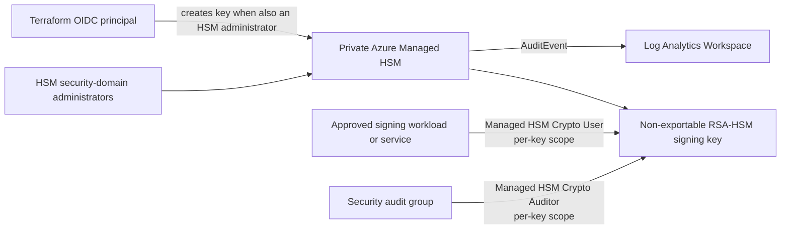

# Managed HSM key custody

This repository implements an optional Azure Managed HSM key-custody pattern for non-exportable code-signing keys. It is not a certificate authority and does not issue TLS certificates.

## Architecture



The HSM has no public network access, a private endpoint, private DNS, soft delete, and purge protection. Terraform creates an `RSA-HSM` key with only `sign` and `verify` operations. The private key never appears in Git, Terraform state, logs, or application configuration.

## Enable the signing key

Use a dedicated environment variable file that is not committed. The Terraform execution principal must be one of `managed_hsm_admin_object_ids`, because HSM key creation is a data-plane operation.

```hcl
managed_hsm_enabled              = true
managed_hsm_name                 = "mhsm-example-prod"
managed_hsm_admin_object_ids     = ["<security-domain-admin-object-id>"]
managed_hsm_signing_key_enabled  = true
managed_hsm_signing_key_name     = "release-signing"
managed_hsm_signing_principal_ids = ["<signing-workload-managed-identity-object-id>"]
managed_hsm_auditor_principal_ids = ["<security-audit-group-object-id>"]
```

Terraform assigns the custom **Platform signing client** role only at `/keys/release-signing` to signing identities. It grants key metadata read, sign, and verify without key-management permissions. Auditors receive **Managed HSM Crypto Auditor** at that same scope. Do not grant broad HSM administrator, crypto officer, or subscription Contributor roles to application identities.

Run the preflight from a host with private DNS and network access to the HSM:

```powershell
./scripts/test-managed-hsm-preflight.ps1 `
  -HsmName mhsm-example-prod `
  -SigningKeyName release-signing
```

The script verifies key type, allowed operations, purge protection, and local role assignments. It does not sign data or display cryptographic material.

## Signing consumer integration

The consuming service authenticates with a managed identity or workload identity, obtains an Entra token, and uses the Managed HSM crypto API to sign a digest. The service stores the signature and public-key certificate chain with the artifact; it never retrieves the private key.

Use a dedicated signing service or CI runner in the private network. Bind its identity to the exact signing key through `managed_hsm_signing_principal_ids`. A code-signing client can use Azure SDK `CryptographyClient` or an approved PKCS#11 integration. Keep signing authorization, release approval, and artifact provenance outside this reference platform because they are organization-specific controls.

## Rotation and recovery

Terraform configures a two-year key lifetime and automatic rotation 90 days before expiry. Update consumers to trust the new public key or certificate chain before retiring old signatures.

Security-domain backup is a separate, quorum-controlled recovery ceremony. Maintain the encrypted security-domain backup, quorum wrapping certificates, recovery runbook, and named custodians in an approved offline location. Do not automate its download into Terraform, CI, or developer workstations. Test recovery under a documented change window.

For BYOK, import key material through an approved, vendor-supported Managed HSM import ceremony from an isolated security workstation. Terraform must reference the imported key only after security approval; it must never receive or manage the source private material. A separate change request should add that existing key to the platform configuration.

## Audit and operations

`AuditEvent` diagnostics are sent to the existing Log Analytics Workspace. Investigate unexpected role assignments, key changes, signing failures, and network-resolution failures. Example query:

```kusto
AzureDiagnostics
| where ResourceProvider == "MICROSOFT.KEYVAULT"
| where Category == "AuditEvent"
| where Resource has "mhsm-"
| project TimeGenerated, OperationName, ResultType, identity_claim_appid_g, requestUri_s
| order by TimeGenerated desc
```

Managed HSM remains a costed, regional service even while soft deleted. Plan the destruction process carefully: purge protection prevents immediate cleanup by design.

## Boundaries and limitations

- This pattern does not provide an issuing CA, ACME issuer, timestamp authority, artifact attestations, or a PKCS#11 sidecar.
- Azure deployment, private DNS resolution, signing calls, HSM role propagation, and security-domain recovery require verification in a target subscription.
- Managed HSM local RBAC governs its data plane; Azure RBAC still governs resource management. Use Entra PIM for privileged operator access where available.

See [Managed HSM built-in roles](https://learn.microsoft.com/azure/key-vault/managed-hsm/built-in-roles) and [Managed HSM access guidance](https://learn.microsoft.com/azure/key-vault/managed-hsm/how-to-secure-access) for Azure's current role semantics.
