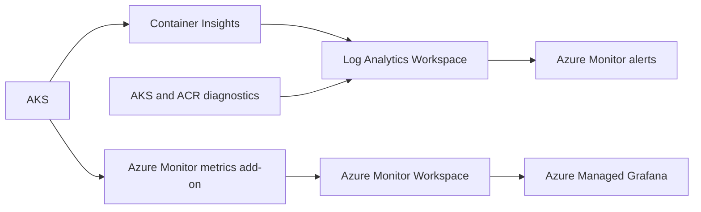

# Azure-native observability

## Architecture



Terraform provisions the workspaces, metrics DCR/DCE association, Azure Managed Grafana, selected AKS/ACR diagnostics, role assignments, and alerts. Argo CD deploys only the Azure Monitor agent scrape configuration in `kube-system` and application annotations. GitHub Actions validates these changes; it does not deploy them with `kubectl apply`.

## Logging

Container Insights sends AKS container and Kubernetes operational data to `law-<project>-<environment>`. The default retention is 30 days and is configurable with `log_analytics_retention_in_days`.

AKS diagnostic settings forward only control-plane, audit, scheduler, autoscaler, and guard categories when Azure exposes them for the selected cluster. ACR forwards only login and repository events. This excludes broad, low-value diagnostic collection.

### Useful KQL

```kusto
// Recent demo application errors
ContainerLogV2
| where TimeGenerated > ago(1h)
| where PodNamespace == "demo"
| where LogMessage has_any ("ERROR", "Exception", "Traceback")
| project TimeGenerated, PodName, ContainerName, LogMessage
| order by TimeGenerated desc
```

```kusto
// Containers with high restart counts
KubePodInventory
| where TimeGenerated > ago(15m)
| summarize RestartCount = max(ContainerRestartCount) by ClusterName, Namespace, Name, ContainerName
| where RestartCount >= 3
| order by RestartCount desc
```

```kusto
// Non-running demo pods
KubePodInventory
| where TimeGenerated > ago(15m)
| where Namespace == "demo"
| summarize LastStatus = arg_max(TimeGenerated, PodStatus) by Name, ContainerName
| where LastStatus != "Running"
```

```kusto
// Recent logs from one namespace
ContainerLogV2
| where TimeGenerated > ago(30m)
| where PodNamespace == "demo"
| project TimeGenerated, PodName, ContainerName, LogMessage
| order by TimeGenerated desc
```

## Metrics and Grafana

The AKS Azure Monitor metrics add-on sends default Kubernetes, node, pod, workload, and control-plane Prometheus metrics to `amw-<project>-<environment>`. These cover CPU, memory, pod status, node health, restart counts, and workload availability without operating an in-cluster Prometheus server.

`amg-<project>-<environment>` integrates with the Azure Monitor workspace through its system-assigned managed identity. Terraform grants that identity `Monitoring Data Reader` on the Azure Monitor workspace, `Log Analytics Reader` on the Log Analytics workspace, and `Monitoring Reader` on AKS. No Grafana API key or data-source credential is stored in Git.

The Azure Monitor agent uses the Argo-managed `ama-metrics-prometheus-config` ConfigMap to scrape only annotated pods. The demo API exposes `/metrics` and is annotated for a 30-second scrape interval. Confirm ingestion with PromQL in the Azure Monitor workspace:

```promql
demo_api_health_checks_total
```

Access Grafana through the Terraform `azure_managed_grafana_endpoint` output. Set `grafana_admin_group_object_id` to grant an Entra group Grafana Admin on the workspace. Use Azure's built-in AKS/Managed Prometheus dashboards first; create custom dashboards only for an identified operational need.

## Alerts

Terraform creates two Log Analytics query alerts:

| Alert | Condition | Operator response |
| --- | --- | --- |
| Excessive container restarts | A container reaches three restarts in 15 minutes | Review application logs, probes, recent images, and resource pressure. |
| Demo API has no running pods | No `demo-api` pod is running in the last 15 minutes | Review Deployment status, scheduling, image pulls, and startup logs. |

Set `alert_action_group_ids` to existing Azure Monitor action-group resource IDs to deliver notifications. The default empty value creates alert rules without hard-coded recipients.

## Security and networking

AKS uses managed identity for Container Insights and the managed metrics pipeline. Azure Managed Grafana uses its system-assigned managed identity for data access. Application metrics require no Azure credential and expose only process and health-counter telemetry; do not add request bodies, tokens, user identifiers, or unbounded labels.

Public network access is disabled by default for the Azure Monitor Workspace, its data collection endpoint, and Azure Managed Grafana. Before deployment, provide private endpoints, private DNS, and an Azure Monitor Private Link Scope so AKS can ingest telemetry and authorized users can access Grafana. Microsoft Entra authentication and explicit RBAC remain required. The public-access variables are retained only as an explicit, reviewed exception for short-lived development environments.

## Troubleshooting

- Verify Container Insights with `kubectl -n kube-system get pods | findstr ama` and query `ContainerLogV2` after generating workload traffic.
- Verify Prometheus agent configuration with `kubectl -n kube-system get configmap ama-metrics-prometheus-config` and inspect `ama-metrics` pod logs after an Argo sync.
- Verify the Azure association with `az monitor data-collection rule association list --resource <aks-resource-id>`.
- Verify Grafana access assignments and wait for Azure RBAC propagation before troubleshooting dashboard permissions.
- If logs or metrics do not arrive, confirm AKS outbound connectivity to Azure Monitor endpoints; private networking requires the appropriate Azure Monitor Private Link design.

## Cost considerations

- Log Analytics ingestion and retention are the main logging cost drivers. Start with 30 days and avoid collecting every diagnostic category.
- Managed Prometheus cost grows with active time series and label cardinality. The configuration scrapes only annotated workloads and avoids copying arbitrary Kubernetes labels or annotations.
- Azure Managed Grafana Standard has a service cost. Use its built-in AKS dashboards before adding a dashboard estate.
- Alerts can incur evaluation and notification costs. The MVP uses two high-signal rules and no built-in notification destination.

## Limitations

- The Terraform configuration is locally validated only; Azure deployment remains required to validate regional availability, diagnostic categories, and data ingestion.
- This MVP does not yet provision the private endpoints, private DNS, or Azure Monitor Private Link Scope required by its private-access defaults. Add those network components before Azure deployment, along with dashboard-as-code, action groups, and long-term archive retention.
- KQL table schemas can vary as Azure Monitor evolves; validate queries against the deployed workspace before operationalizing runbooks.
