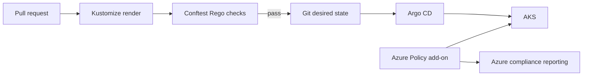

# Policy as code

## Model

The platform applies policy in two layers:

1. GitHub Actions renders every Argo CD source and evaluates it with version-pinned Conftest and Rego policies. This is the primary, pull-request feedback loop.
2. Terraform enables the supported AKS Azure Policy add-on. Platform administrators can assign Azure built-in Kubernetes initiatives centrally after an audit period; the add-on is not replaced with a separately installed Gatekeeper.



## Enforced pull-request baseline

`policies/kubernetes/security.rego` evaluates Deployments, StatefulSets, and DaemonSets. It denies workloads that lack:

- pod-level `runAsNonRoot`;
- disabled privilege escalation and a read-only root filesystem;
- CPU and memory requests and limits;
- readiness and liveness probes; or
- an immutable image tag other than `latest`.

Run the same validation locally after installing Conftest `0.68.2`:

```bash
conftest verify --policy policies/kubernetes
kubectl kustomize applications | conftest test --policy policies/kubernetes -
```

Policies and their Rego tests are reviewed like application code. Any exception must be narrow, time-bound, documented in the pull request, and implemented as an explicit policy change rather than a CI bypass.

## Azure Policy rollout

AKS enables the Azure Policy add-on through Terraform. This repository intentionally does not assign a tenant-wide initiative: subscriptions differ in exemptions, platform ownership, and existing policy assignments. Assign Azure built-in Kubernetes policies at the AKS resource or resource-group scope with **Audit** first, review compliance and system namespace exclusions, then change selected controls to **Deny** through Terraform.

Start with the built-in Kubernetes pod-security baseline initiative, and avoid overlapping enforcement with another standalone Gatekeeper installation. Azure Policy uses Gatekeeper internally and provides centralized compliance reporting. Keep Azure Policy assignments in Terraform because they are Azure governance resources; keep the Rego PR checks in Git because they are repository delivery controls.

## Operations

When a pull request fails, correct the declared workload rather than mutating the live cluster. If a runtime Azure Policy blocks an Argo sync, inspect the Azure Policy compliance result and the Kubernetes admission event, then make a reviewed Git or Terraform change. Do not grant Argo CD permission to bypass policy webhooks.
