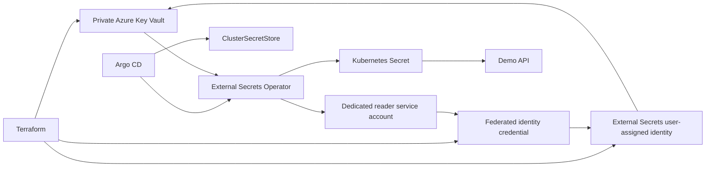
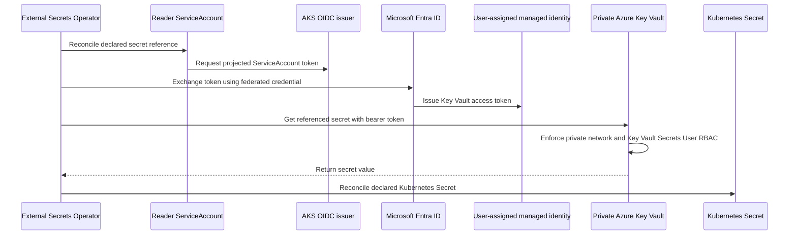

# Azure Key Vault secret management

## Architecture



Terraform creates an RBAC-enabled Azure Key Vault with public network access disabled, a private endpoint, and a private DNS zone linked to the AKS VNet. It also creates a user-assigned managed identity, federates only `external-secrets/azure-key-vault-reader`, and grants it only `Key Vault Secrets User` on this vault.

Argo CD installs External Secrets Operator and the `azure-key-vault` `ClusterSecretStore`. The operator runs without Azure permissions; it requests a token for the dedicated referenced service account when it reconciles the store. This separation reduces the impact of a controller-pod compromise.

## Authentication and authorization flow

This platform uses AKS Workload Identity rather than a client secret, service-principal password, or Key Vault access policy. The following sequence retrieves a secret without exposing an Azure credential in the cluster:

1. Argo CD reconciles the dedicated `azure-key-vault-reader` ServiceAccount and `ClusterSecretStore` from Git.
2. When External Secrets Operator reconciles a secret reference, AKS provides a projected, short-lived ServiceAccount token to the referenced reader identity.
3. Azure Identity exchanges that token with Microsoft Entra ID through the federated identity credential. The credential accepts only the AKS OIDC issuer, audience `api://AzureADTokenExchange`, and subject `system:serviceaccount:external-secrets:azure-key-vault-reader`.
4. Microsoft Entra ID issues an access token for the user-assigned managed identity. No Azure client secret is created, stored, or mounted in the pod.
5. External Secrets Operator presents that token to the private Key Vault endpoint. Private DNS and network routing must resolve and reach the endpoint before authorization is evaluated.
6. Azure RBAC evaluates the identity's `Key Vault Secrets User` assignment scoped to this Key Vault. It permits secret read operations only; it does not allow creating, deleting, listing, or managing keys, certificates, or role assignments.
7. Key Vault returns the referenced secret to External Secrets Operator, which writes the declared key into the target Kubernetes Secret. The application reads the Kubernetes Secret; it does not receive Key Vault management permissions.



### Authorization boundaries

| Component | Permission | Explicitly not permitted |
| --- | --- | --- |
| External Secrets reader identity | Read secrets from the platform Key Vault through `Key Vault Secrets User` | Create, update, delete, list, or export secrets; manage keys, certificates, or Azure RBAC |
| External Secrets Operator controller | Reconcile Kubernetes resources through its Kubernetes RBAC | Direct Azure Key Vault access without the referenced reader ServiceAccount |
| Demo application | Read the synchronized Kubernetes Secret allowed by namespace RBAC | Direct Key Vault access or Azure key-management operations |
| Platform operator | Populate or rotate secret values from an approved private-network workstation | Embed values in Git, Terraform variables, Terraform state, or manifests |

The `Key Vault Secrets User` role can read any secret in the vault. For production, use a separate vault or a separately scoped secret-consumption identity when applications need stronger isolation than a shared platform secret vault can provide.

## Bootstrap configuration

After `terraform apply`, obtain the non-secret identifiers:

```bash
terraform -chdir=infrastructure/environments/dev output key_vault_uri
terraform -chdir=infrastructure/environments/dev output external_secrets_client_id
terraform -chdir=infrastructure/environments/dev output tenant_id
```

Replace the three `REPLACE_WITH_TERRAFORM_*` values in `platform/secret-management/config/` in a pull request. They are resource identifiers, not secrets. Argo CD then reconciles the reader service account and the `ClusterSecretStore`.

Populate values only from an approved operator workstation with private DNS/network access to the Key Vault. Never place values in Terraform variables, state, Kubernetes manifests, or Git:

```bash
az keyvault secret set \
  --vault-name "$(terraform -chdir=infrastructure/environments/dev output -raw key_vault_name)" \
  --name demo-api-runtime-token \
  --value '<supply-from-approved-secret-source>'
```

The demo `ExternalSecret` maps this Key Vault value to the `runtime-token` key of the `demo-api-runtime` Kubernetes Secret. The deployment treats that Secret as optional so the reference application remains deployable before the value is populated; production workloads should make required secrets non-optional.

## Operations

```bash
kubectl -n external-secrets get clustersecretstore azure-key-vault
kubectl -n demo get externalsecret demo-api-runtime
kubectl -n demo get secret demo-api-runtime
```

If synchronization fails, inspect `kubectl -n demo describe externalsecret demo-api-runtime` and verify private DNS resolves `<vault>.vault.azure.net` to the private endpoint from the AKS VNet. Confirm the federated credential issuer is the cluster OIDC issuer, its subject exactly matches `system:serviceaccount:external-secrets:azure-key-vault-reader`, its audience is `api://AzureADTokenExchange`, and that the identity has `Key Vault Secrets User` at this Key Vault scope. A `403` indicates Azure RBAC or Key Vault authorization; a DNS or connection error indicates private-network configuration before Key Vault authorization is reached.

## Security and cost

- Secret values are deliberately not managed by Terraform because Terraform state can retain secret material.
- The generated Kubernetes Secret is still sensitive cluster data; restrict namespace RBAC and use etcd encryption and secret rotation policies appropriate to the environment.
- Key Vault is private-only. Operators need private network connectivity to set or rotate values.
- The dev vault uses seven-day soft delete and disables purge protection so `terraform destroy` is practical. Enable purge protection and use a longer retention period for production.
- Key Vault operations and private endpoints incur Azure charges. Keep refresh intervals and secret volume appropriate to the workload.
