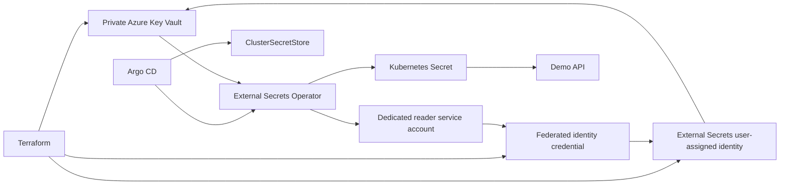

# Azure Key Vault secret management

## Architecture



Terraform creates an RBAC-enabled Azure Key Vault with public network access disabled, a private endpoint, and a private DNS zone linked to the AKS VNet. It also creates a user-assigned managed identity, federates only `external-secrets/azure-key-vault-reader`, and grants it only `Key Vault Secrets User` on this vault.

Argo CD installs External Secrets Operator and the `azure-key-vault` `ClusterSecretStore`. The operator runs without Azure permissions; it requests a token for the dedicated referenced service account when it reconciles the store. This separation reduces the impact of a controller-pod compromise.

## Bootstrap configuration

After `terraform apply`, obtain the non-secret identifiers:

```bash
terraform -chdir=infrastructure/environments/dev output key_vault_uri
terraform -chdir=infrastructure/environments/dev output external_secrets_client_id
terraform -chdir=infrastructure/environments/dev output tenant_id
```

Replace the three `REPLACE_WITH_TERRAFORM_*` values in `platform/secret-management/config/` in a pull request. They are resource identifiers, not secrets. Argo CD then reconciles the reader service account and the `ClusterSecretStore`.

Populate values only from an approved operator workstation with private DNS/network access to the Key Vault. Never place values in Terraform variables, state, Kubernetes manifests, or Git:

```bash
az keyvault secret set \
  --vault-name "$(terraform -chdir=infrastructure/environments/dev output -raw key_vault_name)" \
  --name demo-api-runtime-token \
  --value '<supply-from-approved-secret-source>'
```

The demo `ExternalSecret` maps this Key Vault value to the `runtime-token` key of the `demo-api-runtime` Kubernetes Secret. The deployment treats that Secret as optional so the reference application remains deployable before the value is populated; production workloads should make required secrets non-optional.

## Operations

```bash
kubectl -n external-secrets get clustersecretstore azure-key-vault
kubectl -n demo get externalsecret demo-api-runtime
kubectl -n demo get secret demo-api-runtime
```

If synchronization fails, inspect `kubectl -n demo describe externalsecret demo-api-runtime` and verify private DNS resolves `<vault>.vault.azure.net` to the private endpoint from the AKS VNet. Confirm the federated credential subject exactly matches `system:serviceaccount:external-secrets:azure-key-vault-reader` and that the identity has `Key Vault Secrets User` at this Key Vault scope.

## Security and cost

- Secret values are deliberately not managed by Terraform because Terraform state can retain secret material.
- The generated Kubernetes Secret is still sensitive cluster data; restrict namespace RBAC and use etcd encryption and secret rotation policies appropriate to the environment.
- Key Vault is private-only. Operators need private network connectivity to set or rotate values.
- The dev vault uses seven-day soft delete and disables purge protection so `terraform destroy` is practical. Enable purge protection and use a longer retention period for production.
- Key Vault operations and private endpoints incur Azure charges. Keep refresh intervals and secret volume appropriate to the workload.
